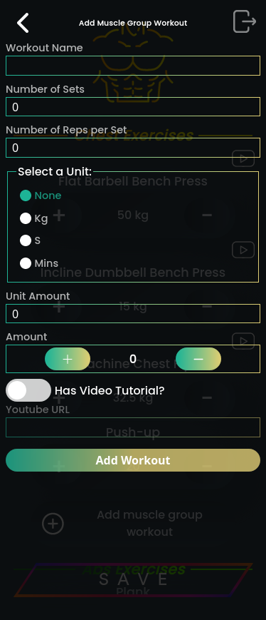

  <a href="https://gym-routine-tracker.netlify.app">
    </img>
  </a>
  <h3 align="center">Gym Routine Tracker</h3>
  

    A PWA designed to monitor your progress, add personalised excercises and accompany them with tutorial videos.
  

---

  
Table of Contents

  <ol>
    <li>
      <a href="#about">About</a>
    </li>
    <li>
      <a href="#built-with">Built With</a>
    </li>
    <li>
      <a href="#guide">Guide</a>
    </li>
  </ol>

## About

To regularly go to the gym, I need to overcome a set of challenges. Some of them are:
<ul>
  <li>
    I need to have knowledge of a multitude of different exercises for each of the muscles that I want to target.
  </li>
  <li>
    I need to keep track of the amount of resistance that I have applied to each exercise.
  </li>
  <li>
    I need quick access to knowledge on how to perform these exercises in case I forget or to prevent me from hurting myself.
  </li>
  <li>
    I need some way of modifying the set of exercises to suit my needs.
  </li>
  <li>
    And I need to distribute the exercises so that no major muscle group is left ignored.
  </li>
</ul>
For someone who is new to the gym with the intention of forming new habits, having to overcome these challenges can make going to the gym really offputting
so the purpose of this app is to hopefully solve or at least address these issues. 

## Built With

The frontend was built with [![React][react-badge]][react-url]  
The languages used were [![Typescript][typescript-badge]][typescript-url], [![HTML][html-badge]][html-url] and [![CSS][css-badge]][css-url]  
The database used is [![MongoDB][mongodb-badge]][mongodb-url]  
The backend runtime used is [![NodeJs][nodejs-badge]][nodejs-url]  
The website is hosted on [![Netlify][netlify-badge]][netlify-url] 

## Guide

  
   
   
   
   
  <h3 align="center">You can start by logging in with your account details and if you don't have you can create an account.</h3>
   
   
   
   

  
   
   
   
   
  <h3 align="center">Each exercise can be grouped base on one of the five major muscle groups: Legs, arms, shoulders, chest and back.</h3>
   
   
   
   

  
   
   
   
   
  <h3 align="center">You can add new exercises and optionally provide a link to a video tutorial for that exercise.</h3>
   
   
   
   

[react-badge]: https://img.shields.io/badge/React-20232A?style=for-the-badge&logo=react&logoColor=61DAFB
[react-url]: https://reactjs.org/
[typescript-badge]: https://shields.io/badge/TypeScript-3178C6?style=for-the-badge&logo=TypeScript&logoColor=FFF
[typescript-url]: https://www.typescriptlang.org/
[html-badge]: https://img.shields.io/badge/HTML5-E34F26?style=for-the-badge&logo=html5&logoColor=white
[html-url]: https://en.wikipedia.org/wiki/HTML
[css-badge]: https://img.shields.io/badge/CSS3-1572B6?style=for-the-badge&logo=css3&logoColor=white
[css-url]: https://en.wikipedia.org/wiki/CSS
[mongodb-badge]: https://img.shields.io/badge/MongoDB-4EA94B?style=for-the-badge&logo=mongodb&logoColor=white
[mongodb-url]: https://www.mongodb.com/
[nodejs-badge]: https://img.shields.io/badge/Node.js-43853D?style=for-the-badge&logo=node.js&logoColor=white
[nodejs-url]: https://nodejs.org/en
[netlify-badge]: https://img.shields.io/badge/Netlify-00C7B7?style=for-the-badge&logo=netlify&logoColor=white
[netlify-url]: https://www.netlify.com/
